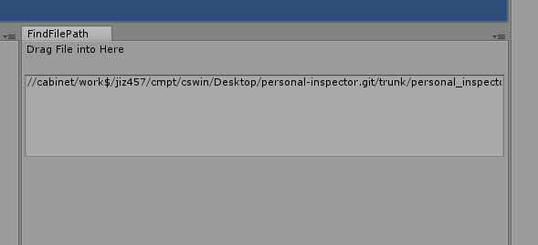
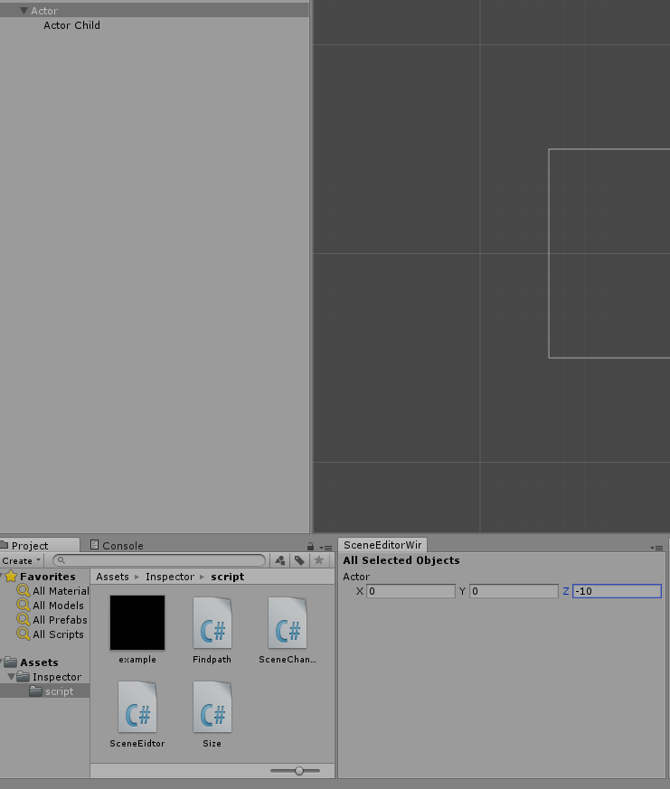

# Personal-inspector 
Personal setting for unity inspector

## How to apply this inspector
Copy and Paste the inspector folder into your project

## Personal setting
1. Find the references of certain file  
    Find who is use this script.    
2. Find the file location   
    Contain the absolute path   
    
3. Personal Scence Editor   
    Make changing actions will clear    
    
4. More..
